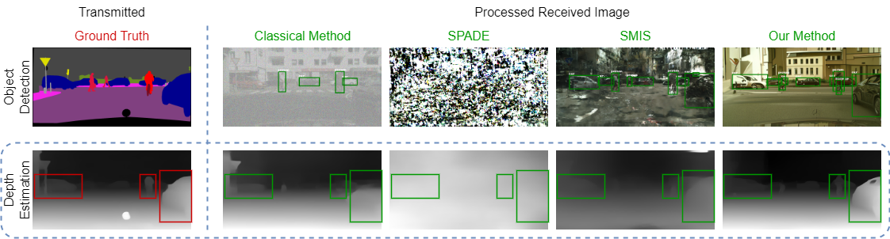

## Generative Semantic Communication: Diffusion Models Beyond Bit Recovery
### [Eleonora Grassucci](https://sites.google.com/uniroma1.it/eleonoragrassucci/home-page), [Sergio Barbarossa](https://sites.google.com/a/uniroma1.it/sergiobarbarossa/), and [Danilo Comminiello](https://danilocomminiello.site.uniroma1.it/)

This repository is under construction! :)

#### Abstract
Semantic communication is expected to be one of the cores of next-generation AI-based communications. One of the possibilities offered by semantic communication is the capability to regenerate, at the destination side, images or videos semantically equivalent to the transmitted ones, without necessarily recovering the transmitted sequence of bits. The current solutions still lack the ability to build complex scenes from the received partial information. Clearly, there is an unmet need to balance the effectiveness of generation methods and the complexity of the transmitted information, possibly taking into account the goal of communication. In this paper, we aim to bridge this gap by proposing a novel generative diffusion-guided framework for semantic communication that leverages the strong abilities of diffusion models in synthesizing multimedia content while preserving semantic features. We reduce bandwidth usage by sending highly-compressed semantic information only. Then, the diffusion model learns to synthesize semantic-consistent scenes through spatially-adaptive normalizations from such denoised semantic information.
We prove, through an in-depth assessment of multiple scenarios,  that our method outperforms existing solutions in generating high-quality images with preserved semantic information even in cases where the received content is significantly degraded. More specifically, our results show that objects, locations, and depths are still recognizable even in the presence of extremely noisy conditions of the communication channel.

#### The GESCO framework

#### Main Results

#### How to use GESCO

Soon

#### Cite

Soon on ArXiv!
